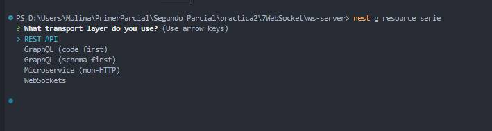
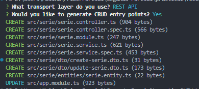
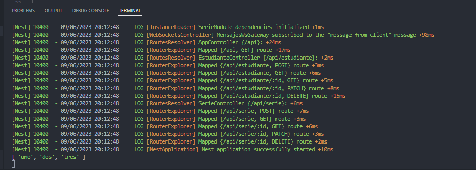
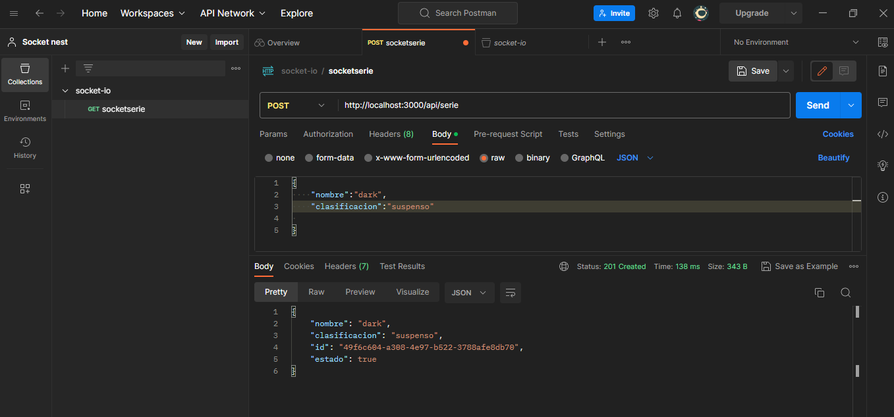
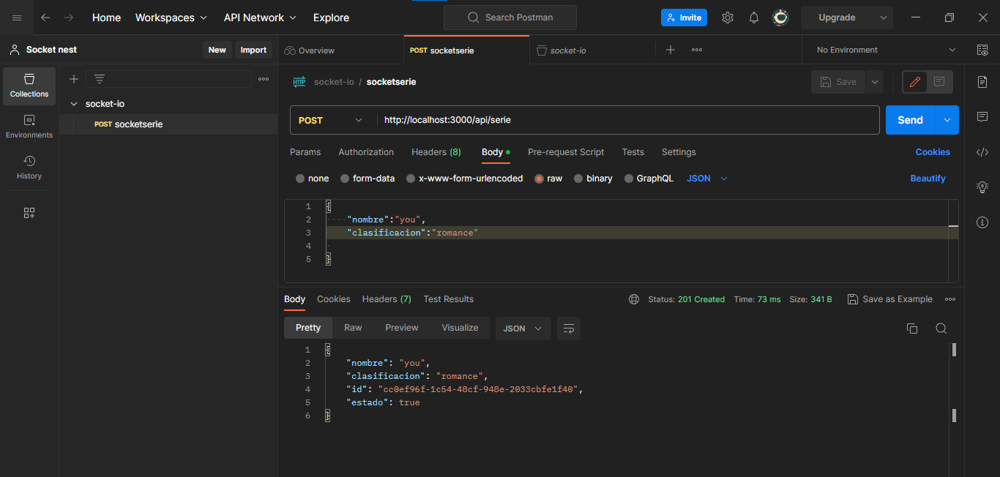
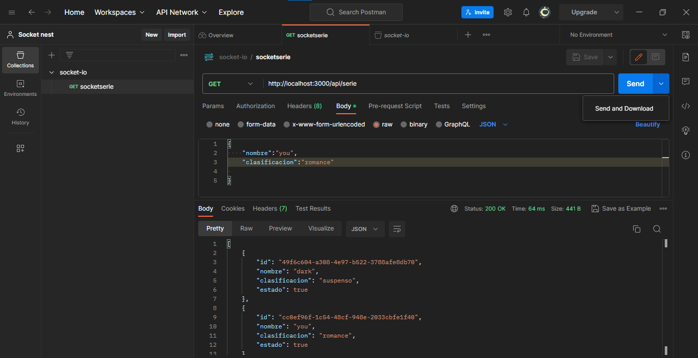
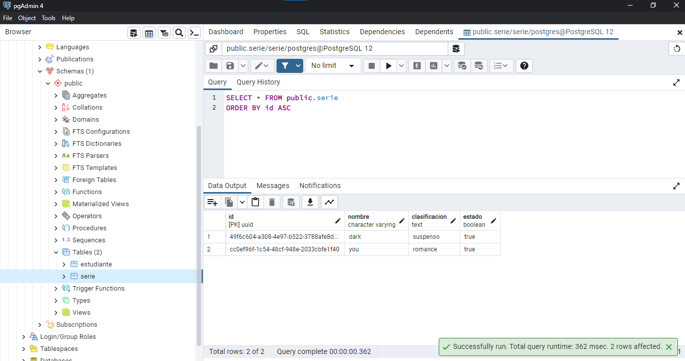
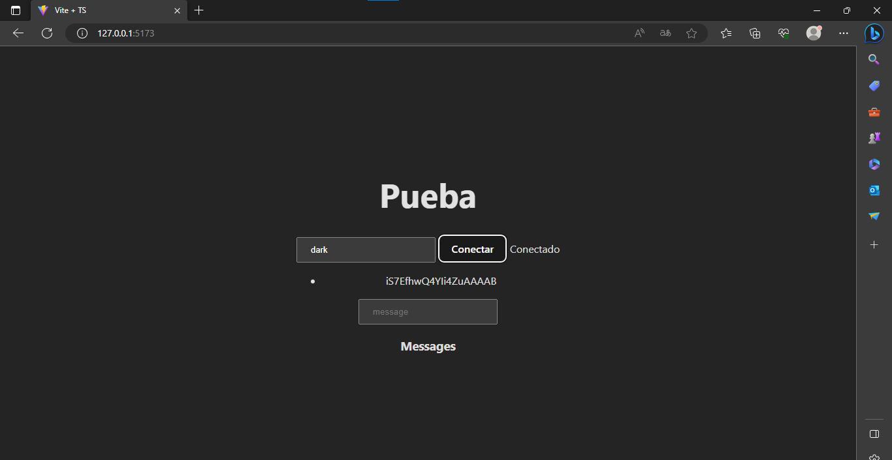
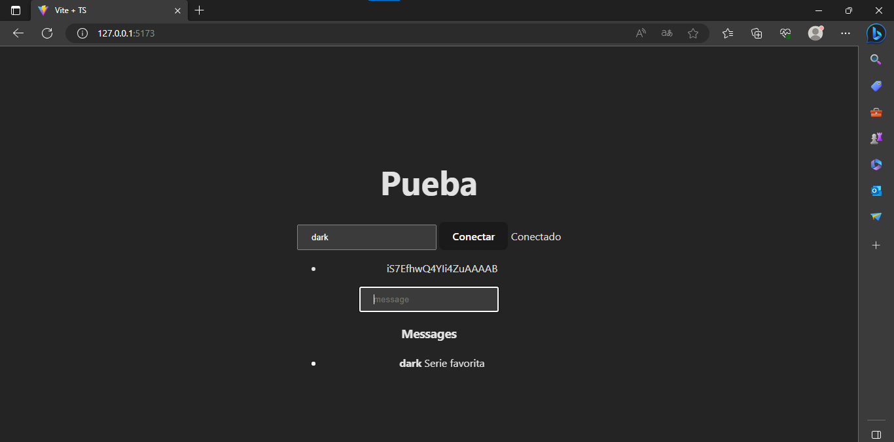

# PRÁCTICA 1 Segundo Parcial

## 1. Socket con Nest 

### Creando recursos de serie

### Usando la Api Rest

### Post

### Get

### Viendo la base de datos

### Conectando con el token

### Enviando el mensaje con la entidad serie

