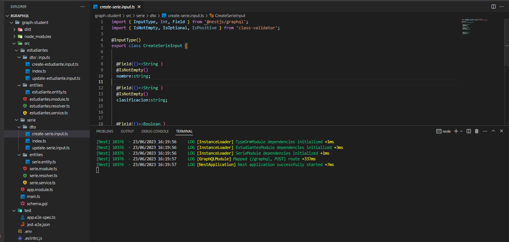
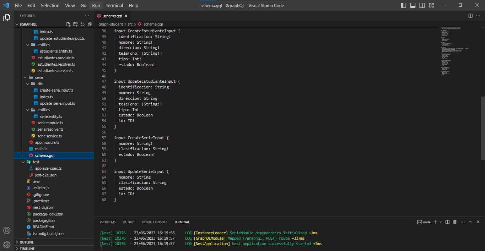
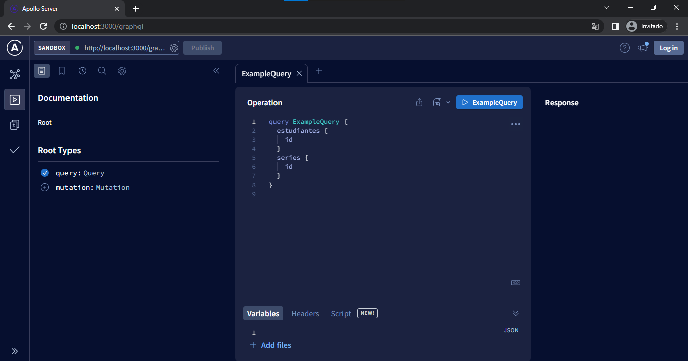
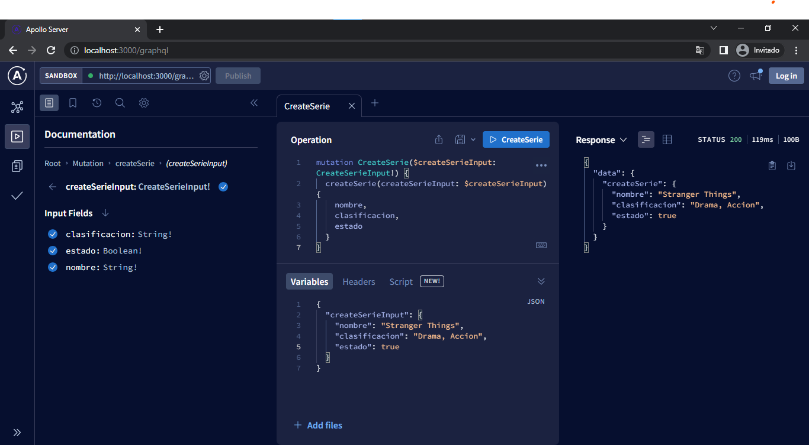
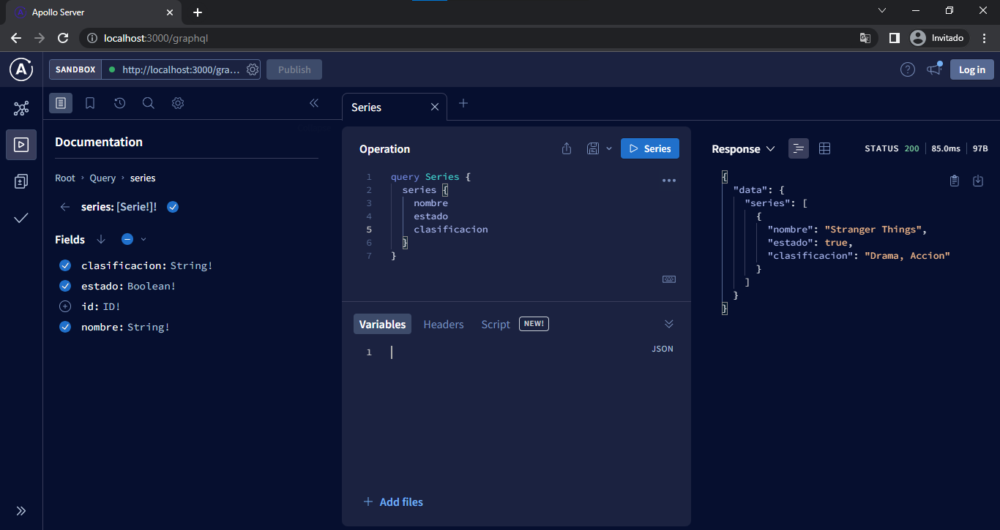
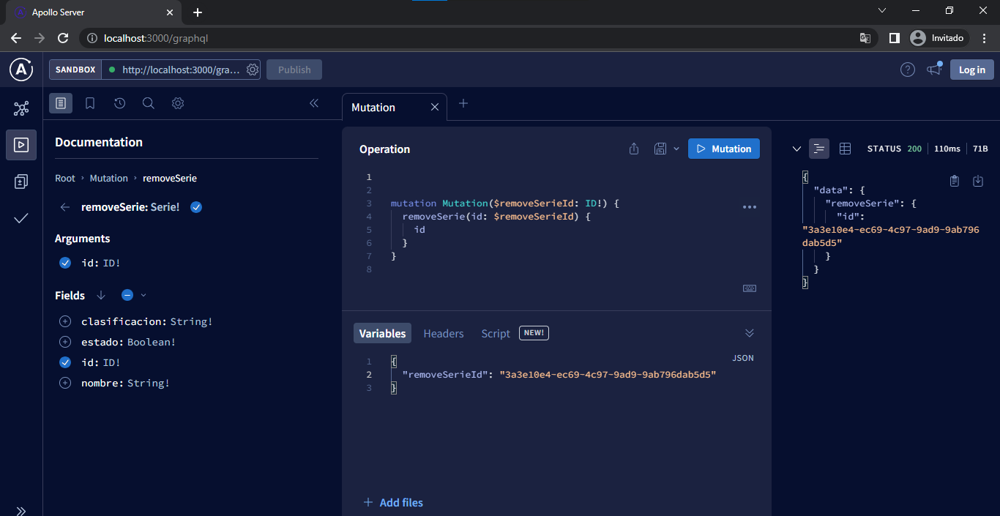
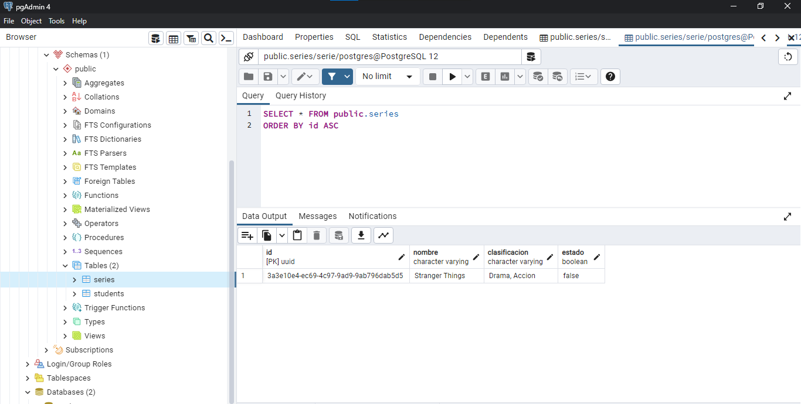
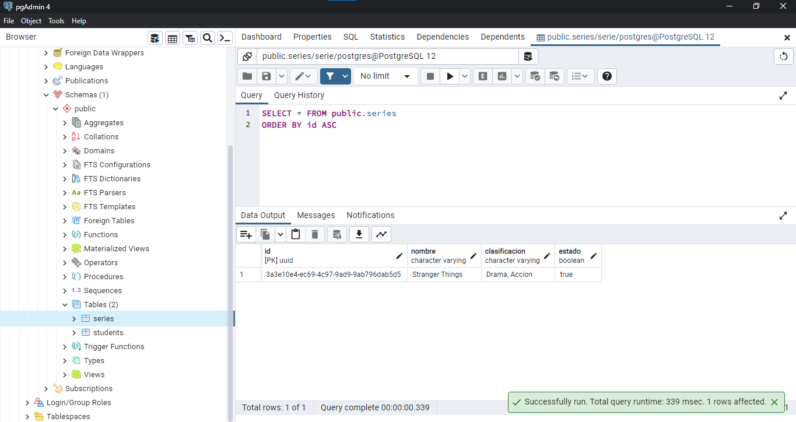

# PRÁCTICA GRAPHQL

  
Evidencia de graphql

## Captures de código fuente 

## Ejecución de Apollo Server

## Creación de Serie mediante mutation

## Query de la Serie

## Aplicando método de eliminación pero no eliminación física

## Cambiando a estado false

## Muestra  en la base de datos

