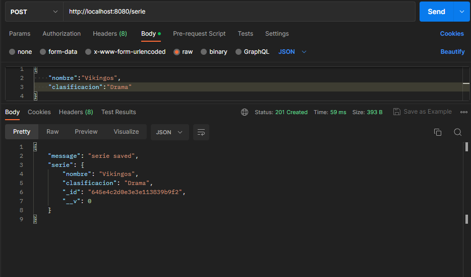
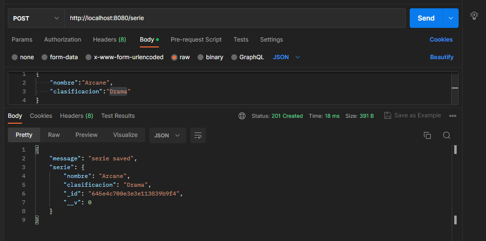
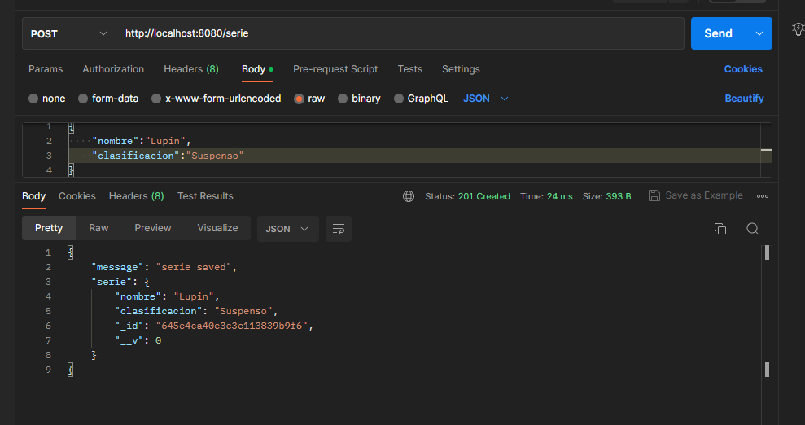
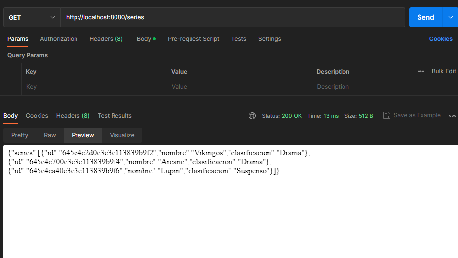
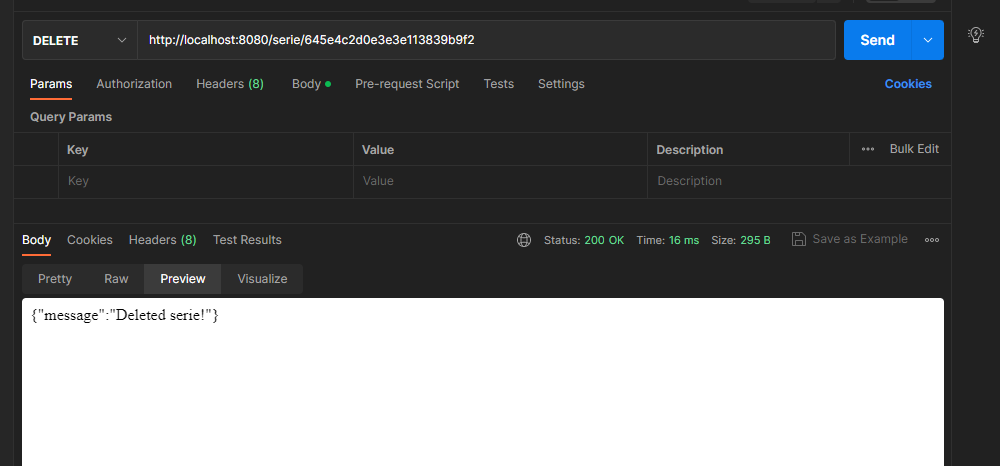
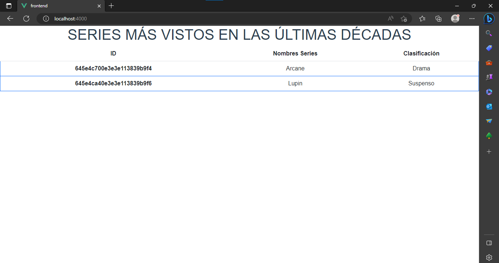
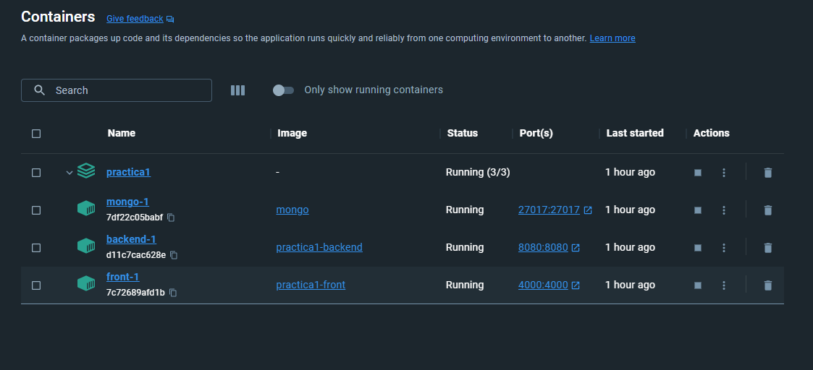

# PRÁCTICA 1

## 1. Definir una base de datos (Relacional o no relacional).

*Se uso la base de datos no relacional de mongo*

## 2.Estructurar un Backend que brinde una de sus entidades  como ruta en servicio REST a cualquier aplicación cliente.

Uso de la api rest mediante postman

## 3. Definir un Frontend que aplique el Backend previamente desarrollado.

## 4. 4. Dockerizar Backend, Frontend y Gestor de base de datos en 3 servicios sobre un mismo archivo Docker-compose.

