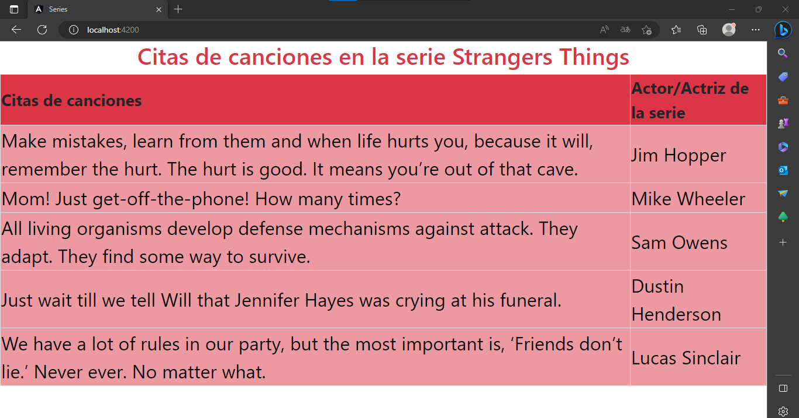
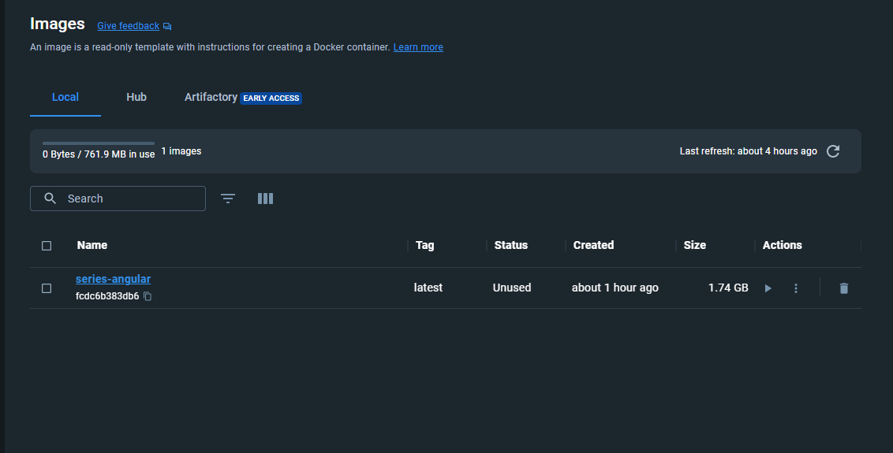
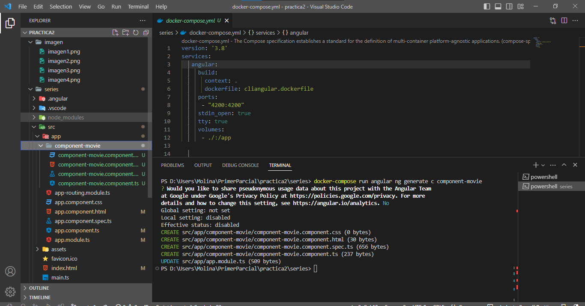
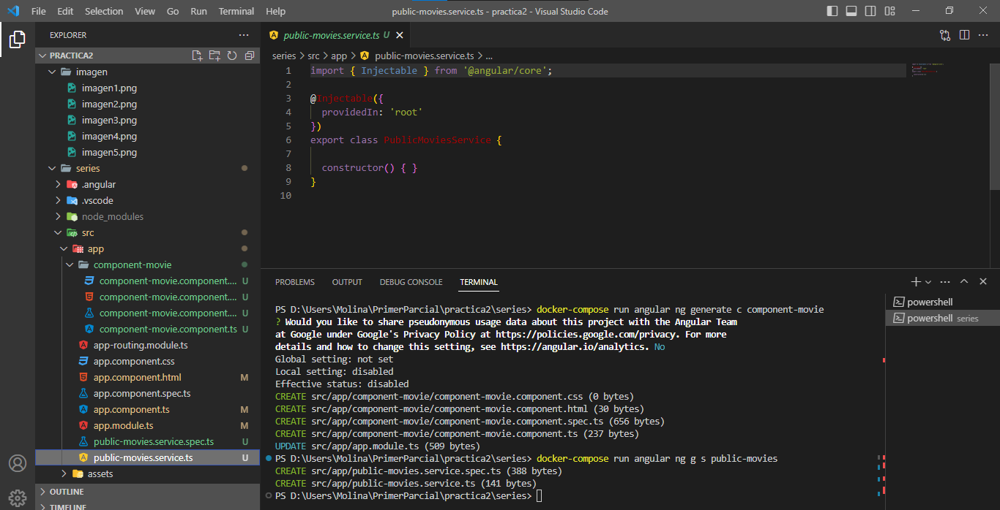
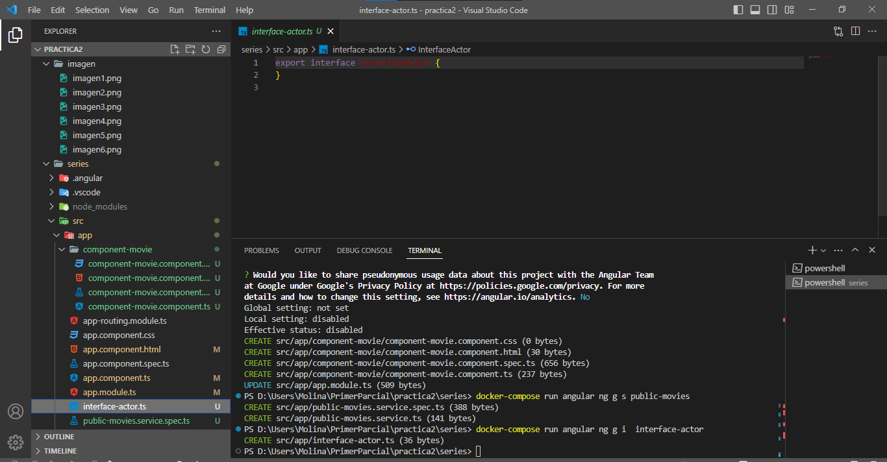
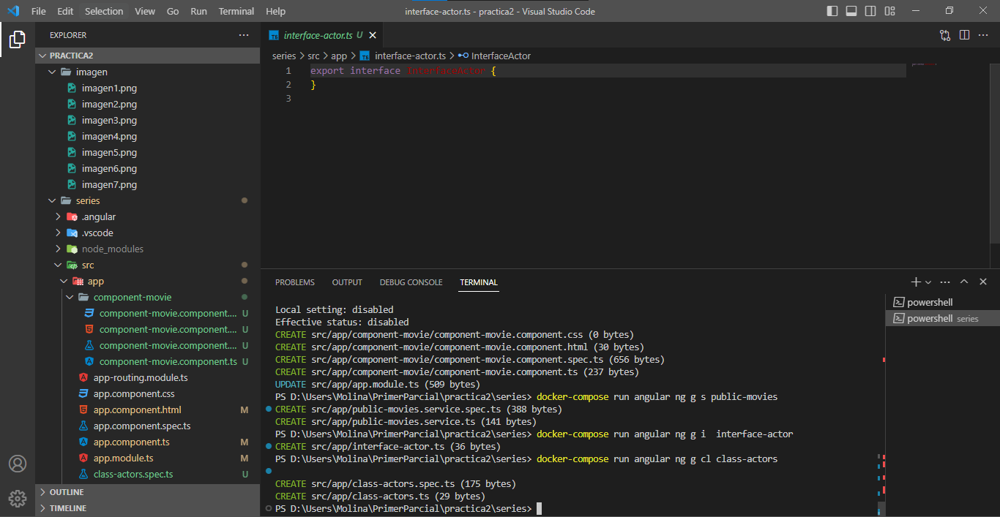
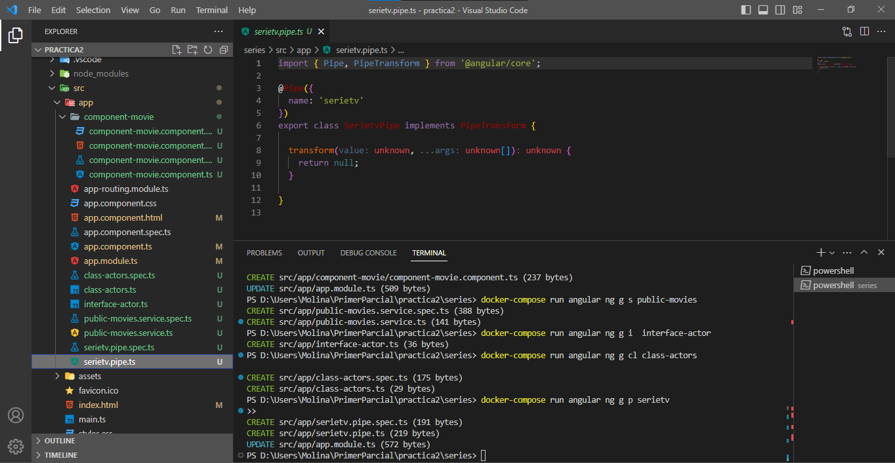
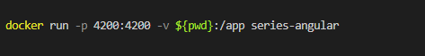
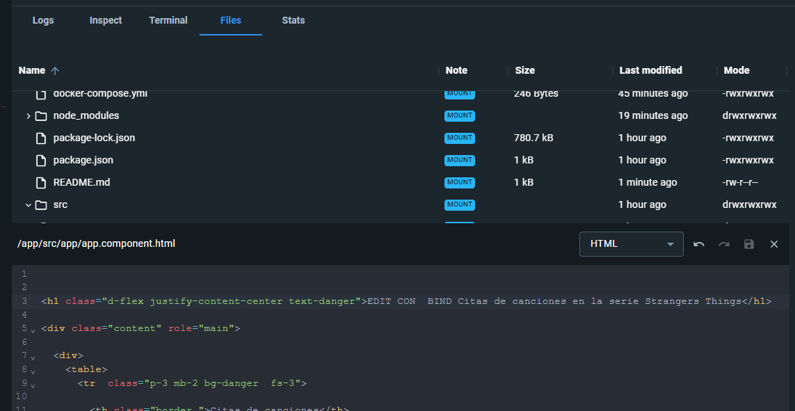
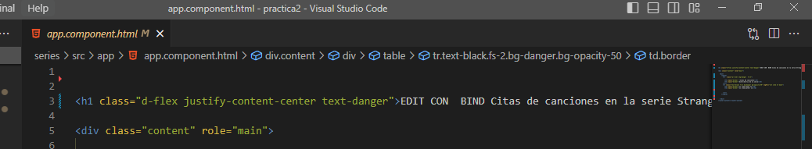

# PRÁCTICA 2

## 1. Montar aplicación desarrollada en semestres anteriores que utilice una tecnología o un framework actual.

*Se monto una aplicación en angular ya que tiene un CLI con muchas funciones*

## 2. Dockerizar todos los componentes de la aplicación para un entorno de desarrollo.

## 3. Utilizar por lo menos 5 funcionalidades de las herramientas, frameworks o CLI aplicando el acceso a los Dockers de forma interactiva.

## 4. Cargar aplicación funcionando y permitir realizar cambios desde el host.

*Aquí fue necesario iniciar el contenedor mediante un volumen para poder acceder a los cambios desde local al contenedor, para crear eso se ubica la bandera -v*

*Se edito una línea de código desde el container, al localhost, se visualiza el cambio*

