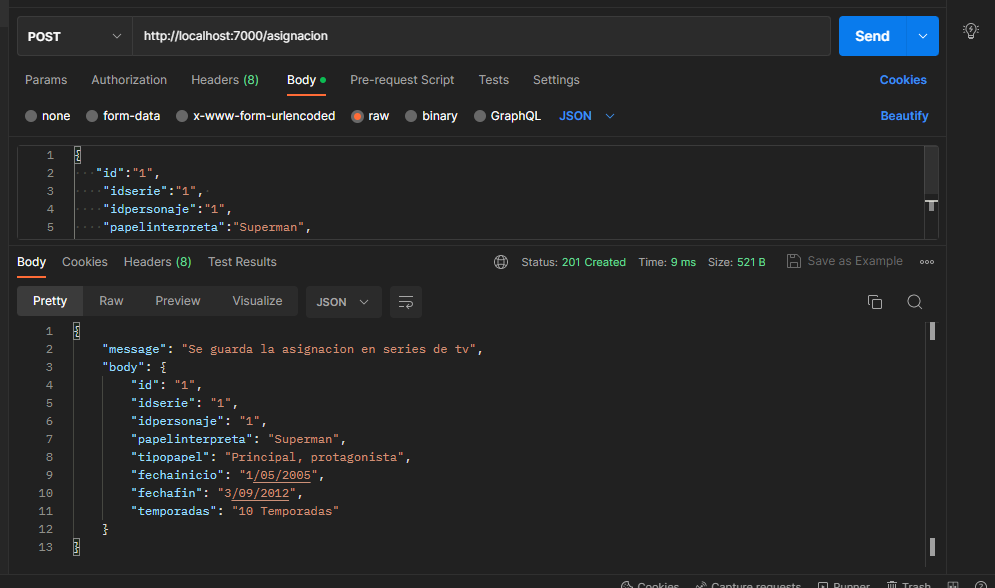
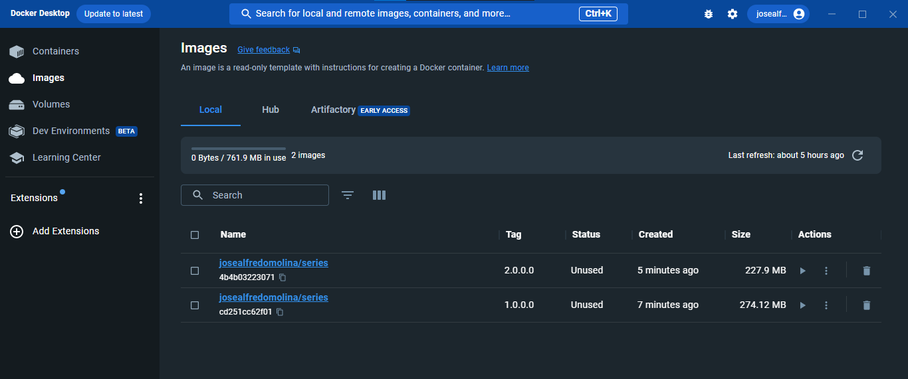

# PRÁCTICA 3

## 1. Desarrollar un servicio REST (aplicar por lo menos 2 métodos del CRUD) basado en la  entidad transaccional asignada al inicio del parcial.

## 2. Aplicar por lo menos una prueba unitaria para los métodos del servicio REST

## 3.Definir una TAG que permita dockerizar tanto el servicio REST como sus pruebas.

## 4.Crear otro TAG que permita llevar multistage con por lo menos 3 etapas sobre el mismo servicio REST

## 5.Subir ambos TAGs a Docker Hub como versiones de la misma imagen.

## 6.Probar localmente la descarga y funcionamiento de dicha imagen publicada con  anterioridad

